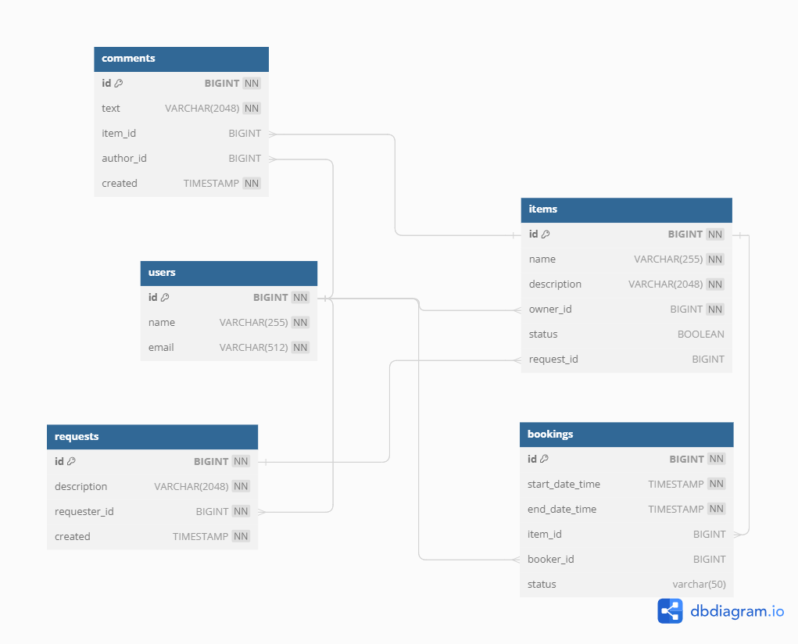

# **Item rental service**

***Описание***

Приложение Item rental service - микросервисное REST приложение для шеринга вещей.
Оно обеспечивает пользователям, возможность рассказывать, какими вещами они готовы поделиться, находить нужную вещь и брать её в аренду на какое-то время.
Сервис позволяет бронировать вещь на определённые даты, закрывать к ней доступ на время бронирования от других желающих. На случай, если нужной вещи на сервисе нет, у пользователей есть возможность оставлять запросы. По запросу можно добавлять новые вещи для шеринга.

***Функционал***

Приложение обеспечивает:

* Запрос на аренду может быть создан любым пользователем, а затем подтверждён или не подтвержден владельцем вещи. Подтверждение или отклонение запроса может произвести только владелец вещи. Получение данных о конкретном бронировании (включая его статус). Может быть выполнено либо автором бронирования, либо владельцем вещи, к которой относится бронирование.

* Возможность для пользователя создавать запрос на вещи, если не смог найти нужную вещь, воспользовавшись поиском. Другие пользователи могут просматривать подобные запросы и, если у них есть описанная вещь и они готовы предоставить её в аренду, добавлять нужную вещь в ответ на запрос.

* Если пользователь видит запрос на вещь, которая у него есть, но она не размещена на платформе, то он может создать её.

* Возможность добавлять, обновлять и удалять комментарии к вещам. Комментарий нельзя добавить, если вы не брали эту вещь в аренду.

* Алгоритм поиска настроен таким образом, чтобы в подборку попадали только вещи доступные для бронирования в данный момент. Сам поиск осуществляется либо по названию вещи, либо идет поиск соответствия запросу в описании вещи.

***Структура хранения данных***

Диаграмма описывает структуру хранения данных приложения. Основные сущности приложения:
* Items - вещи
* Users - пользователи
* Bookings - бронирования
* Comments - комментарии
* Requests - запросы

***Используемые технологии***

* Java 11
* Spring Boot 2.7.2
* Maven
* Hibernate
* Mockito
* Junit 
* Docker
